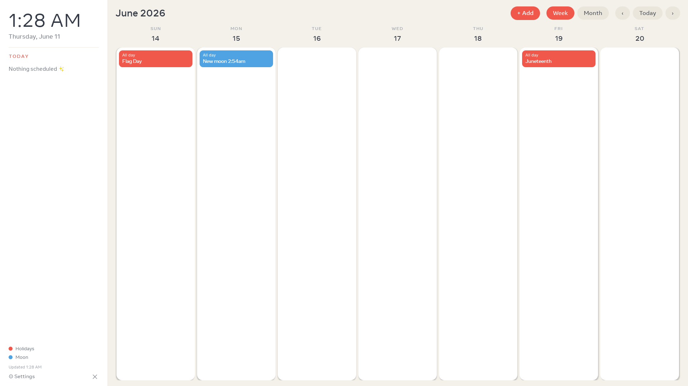
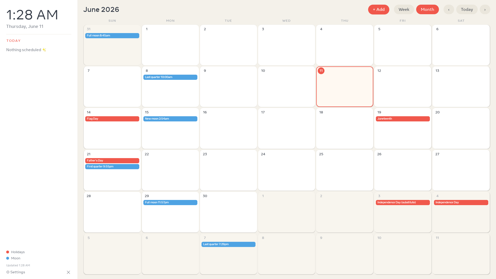

# Family Calendar for Meta Portal

Turn a discontinued **Meta Portal+ (gen 1)** into an always-on family calendar — a
wall display that syncs everyone's Google and Apple calendars, color-coded per person,
with two-way event creation. Think Skylight-style family board, built from a $30
secondhand Portal.

| Week board | Month board |
|---|---|
|  |  |

## What it does

- **Always-on board** — live clock, "Today" agenda sidebar, paging week view and a
  full month view (tap a day for its events, tap an event for details). The board
  always returns to the current week when it takes over the screen.
- **Syncs any calendar that has an iCal feed** — Google Calendar secret addresses,
  iCloud public calendar links (`webcal://`), or any other `.ics` URL. One color per
  person. Recurring events, edited instances, and cancellations all handled.
- **Replaces the screensaver** — when the Portal idles, the calendar takes over the
  screen and stays up, 24/7. Toggle it from the setup page.
- **Add events from the Portal or your phone** — a `+ Add` button on the board, and a
  web setup page served by the Portal itself (`http://<portal-ip>:8090`, QR code shown
  on-screen). Events are written into the **real** calendar (iCloud via CalDAV, Google
  via the Calendar API), so they appear on everyone's phones natively.
- **Set up everything from a phone or computer** — no typing on the Portal. Add/remove
  calendars, connect accounts, trigger syncs, flip the screensaver mode.
- **Survives reboots and offline spells** — feeds are cached on disk; a boot receiver
  re-arms everything with no computer attached.

## Requirements

- Meta Portal+ gen 1 (`aloha`, Android 9 / API 28) with **ADB enabled** and the
  [Immortal launcher](https://github.com/starbrightlab/immortal) provisioned.
  Other Portal models may work but are untested.
- A Mac/Linux/Windows machine with `adb` for the one-time install.
- Wi-Fi shared by the Portal and your phone.

## Install

Grab `app-debug.apk` from Releases (or build it — see below), then:

```sh
adb install -r app-debug.apk
adb shell am start -n com.portal.calendar/.MainActivity
```

That's it. The board shows a QR code; everything else happens from your phone.

## Setup

### 1. Add the calendars to display (read)

Scan the QR code (or open `http://<portal-ip>:8090` in any browser on the same Wi-Fi)
and paste each person's calendar link with a name and color:

- **Google**: calendar.google.com → Settings → *your calendar* → Integrate calendar →
  **"Secret address in iCal format"**. Easiest on a computer — open the setup page
  there too and copy/paste between tabs. (Step-by-step is on the page itself.)
- **Apple/iCloud**: iPhone Calendar app → Calendars → ⓘ → **Public Calendar** →
  Share Link → Copy. `webcal://` links paste straight in.

Every link is test-fetched when you add it, so you know immediately whether it works.
Treat these links like passwords — they grant read access to the calendar.

### 2. Connect an account for adding events (write, optional)

On the setup page, under **Two-way sync**:

- **iCloud**: enter the Apple ID plus an **app-specific password**
  (account.apple.com → Sign-In and Security → App-Specific Passwords). Events are
  created over CalDAV directly in iCloud.
- **Google**: bring your own (free) OAuth client — create a Google Cloud project,
  enable the Calendar API, publish the OAuth consent screen (External/production;
  Testing mode tokens expire weekly), create a **Desktop app** OAuth client, and paste
  its Client ID/secret into the page. Sign in via the generated link; when the browser
  dead-ends on a `localhost` URL, paste that URL back (or swap `localhost` for the
  Portal's IP — the Portal completes it automatically).

Then pick which calendar new events go into. The `+ Add` button on the board and the
"Add an event" form on the page both write there.

### 3. Make it the screensaver

Flip **"Show the calendar when the Portal idles"** on the setup page. From then on the
calendar owns the screen whenever the Portal is idle — including waking it back up when
the Portal tries to sleep. Tap **✕** on the board to get back to the launcher.

Expect a 1–2 second flash of the stock photo frame during the hand-off; that's the
stock launcher relaunching its own frame on the same system broadcast (see below).

## Building from source

Toolchain: JDK 21, Android SDK (compileSdk 36), Gradle wrapper included.

```sh
JAVA_HOME=$(/usr/libexec/java_home -v 21) \
ANDROID_HOME=/path/to/android-sdk \
./gradlew :app:assembleDebug
# → app/build/outputs/apk/debug/app-debug.apk
```

## How it works (the interesting bits)

The Portal is a locked-down Android 9 device: no Google Play Services (so no normal
Google sign-in), no root, locked bootloader. The design works within that:

- **Reading calendars** uses plain ICS feeds (the one auth-free, universal interface),
  parsed with [biweekly](https://github.com/mangstadt/biweekly). Recurrence rules are
  expanded properly, including `RECURRENCE-ID` overrides for edited instances.
- **Writing events** can't use feeds, so there are two real backends: CalDAV for
  iCloud (app-specific password; PROPFIND discovery → PUT VEVENT, via OkHttp because
  `HttpURLConnection` refuses the PROPFIND verb) and the Google Calendar REST API
  with a bring-your-own Desktop OAuth client.
- **The screensaver takeover** doesn't register a DreamService — the launcher
  re-asserts `screensaver_components` on every boot/resume, an unwinnable fight.
  Instead the app listens for `ACTION_DREAMING_STARTED` and ends the dream with a
  `SCREEN_BRIGHT_WAKE_LOCK | ACQUIRE_CAUSES_WAKEUP` wakelock (dream windows draw above
  activities, so you must end the dream, not draw over it), then relaunches the board
  after the dust settles. `ACTION_SCREEN_OFF` is handled the same way, because the
  Portal's presence policy skips the screensaver entirely when it thinks the room is
  empty. A minimal foreground service keeps the process alive to hear the broadcasts.
- **The setup page** is served from the Portal itself by NanoHTTPD on `:8090` — no
  cloud, no accounts, nothing leaves your LAN.

## Privacy & security

Everything stays on the device and your LAN. Calendar URLs, the iCloud app-specific
password, and Google OAuth tokens are stored only in the app's private storage on the
Portal. The setup page is unauthenticated by design (anyone on your Wi-Fi can open
it) — treat your home network accordingly.

## License

[MIT](LICENSE)
